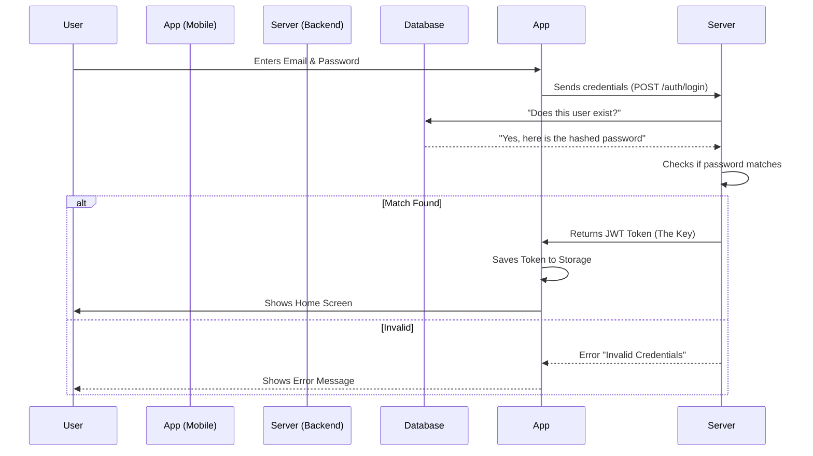

# Authentication Feature Documentation

## 1. Concept: How it Works
Authentication is the process of verifying who a user is. In CineSwipe, we use a secure system to allow users to create accounts, sign in, and stay signed in even after closing the app.

**The Flow:**
1.  **Sign Up**: A user provides their Name, Email, and Password. We securely save this in our database.
2.  **Login**: A user enters their Email and Password. We check if they match what we have on file.
3.  **Tokens (The Key)**: If the password is correct, the server gives the app a digital "Key" (called a **JWT Token**).
4.  **Staying Logged In**: The app saves this Key on the phone. Every time the app opens, it shows this Key to the server to prove "It's me!".

## 2. Configuration: Where is it set up?

### Backend Setup
The server needs a secret password to create these digital Keys. This is stored in a secure file called `.env`.

*   **File Location**: `cineswipe-backend/.env`
*   **Key Variable**: `JWT_SECRET`
    *   **Value**: A long, random string of text (e.g., `super_secret_key_123`).
    *   **Purpose**: This is used to "sign" the tokens so nobody else can fake them.

### Mobile App Setup
The app needs to know *where* the server is to send the password.

*   **File Location**: `cineswipe-mobile/src/lib/api.ts`
*   **Variable**: `API_BASE_URL`
    *   **Value**: `http://localhost:3001` (for local testing).
    *   **Purpose**: Tells the app to talk to your computer's server.

## 3. Implementation: How did we build it?

### The Database (Backend)
We store user data in a table called `User`.
*   **File**: `cineswipe-backend/prisma/schema.prisma`
*   **Fields**:
    *   `email` (Unique ID)
    *   `password` (We **NEVER** save the actual password. We save a "hashed" version—a scrambled code that can't be unscrambled, only verified).

### The API Routes (Backend)
These are the "doors" the app knocks on.
*   **File**: `cineswipe-backend/src/routes/auth.ts`
*   **Register Door (`POST /auth/register`)**:
    *   Takes Name, Email, Password.
    *   Scrambles the password.
    *   Saves to Database.
    *   Returns the digital Key (Token).
*   **Login Door (`POST /auth/login`)**:
    *   Finds user by Email.
    *   Checks if the scrambled password matches.
    *   Returns the digital Key (Token).

### The Mobile App Logic (Frontend)
*   **File**: `cineswipe-mobile/src/lib/store.ts`
    *   This is the "Brain" of the app. It holds the current user's info.
    *   When you login, it saves the Token to the phone's secure storage (`AsyncStorage`).
*   **Screens**:
    *   `cineswipe-mobile/app/login.tsx`: The screen with Email/Password boxes.
    *   `cineswipe-mobile/app/signup.tsx`: The screen to create a new user.

## 4. Visual Flow

