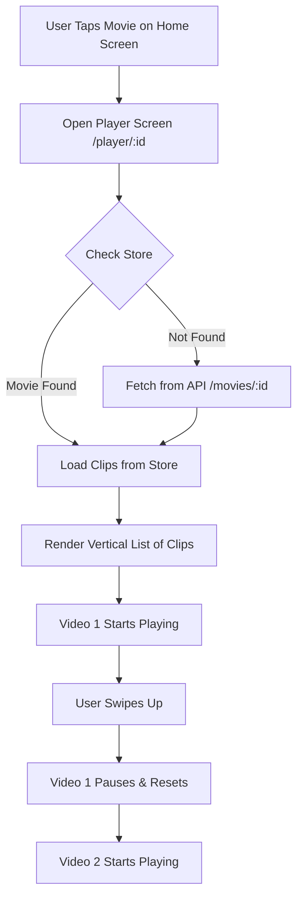

# Movies & Player Feature Documentation

## 1. Concept: How it Works
This serves the core purpose of CineSwipe: browsing and watching movies. It's designed like TikTok or Instagram Reels—you see one full-screen video at a time, and you swipe up to see the next one.

**Key Features:**
*   **Feed**: A never-ending list of movie clips.
*   **Immersive**: Videos take up the *entire* screen.
*   **Smart Playback**: Only the video you are looking at plays. The others pause to save battery and data.

## 2. Configuration: Where is it set up?

### Data Source (Backend)
This feature relies on two main data types in our system:
1.  **Movies**: The actual film titles (e.g., "Dune", "Inception").
2.  **Clips**: Short video trailers associated with a movie. A movie can have many clips.

*   **Database Schema**: Defined in `cineswipe-backend/prisma/schema.prisma`.
*   **Initial Data**: We created a "Seed Script" (`cineswipe-backend/prisma/seed.ts`) that automatically fills the database with 25 mock movies and creates 1-10 clips for each one so you have something to watch immediately.

### Video Player Config (Frontend)
*   **File**: `cineswipe-mobile/app/player/[id].tsx`
*   **Screen Size**: We configure the video to match `Dimensions.get('screen')`. This ensures it covers the status bar and navigation bar for a true full-screen feel.

## 3. Implementation: How did we build it?

### The "TikTok" Scroll Effect
We use a component called `FlatList` with a special property called `pagingEnabled`.
*   **What it does**: It forces the scroll to "snap" to the next item, rather than stopping halfway.
*   **File**: `cineswipe-mobile/app/player/[id].tsx`

### Dynamic Video Sizing
Videos uploaded by admins can have any aspect ratio (16:9, 9:16, 4:3, etc.). The player dynamically fits the **entire video** onto the screen.
*   **Resize Mode**: We use `ResizeMode.CONTAIN`.
    *   The video is scaled to fit entirely within the screen.
    *   If the aspect ratio doesn't match (e.g., a horizontal video on a vertical phone), black bars (letterboxing) appear.
*   **Why CONTAIN?**: Ensures the user always sees the *complete* video, not a cropped version.
1.  **Tracking**: We track which index (video number 1, 2, 3...) is currently visible on the screen.
2.  **The Component**: We built a custom component called `ClipPlayer`.
3.  **The Logic**:
    *   If `index == visibleIndex`: **PLAY**.
    *   If `index != visibleIndex`: **PAUSE** and rewind to start.

### Touch Passthrough (The "Ghost" Layer)
**The Problem**: When a video is full screen, it covers the "Back" and "Like" buttons, so you can't click them.
**The Fix**: We used `pointerEvents="none"` on the video container.
*   This makes the video invisible to touches.
*   Your finger "passes through" the video and hits the buttons underneath (or overlaying) it.

## 4. Visual Flow

