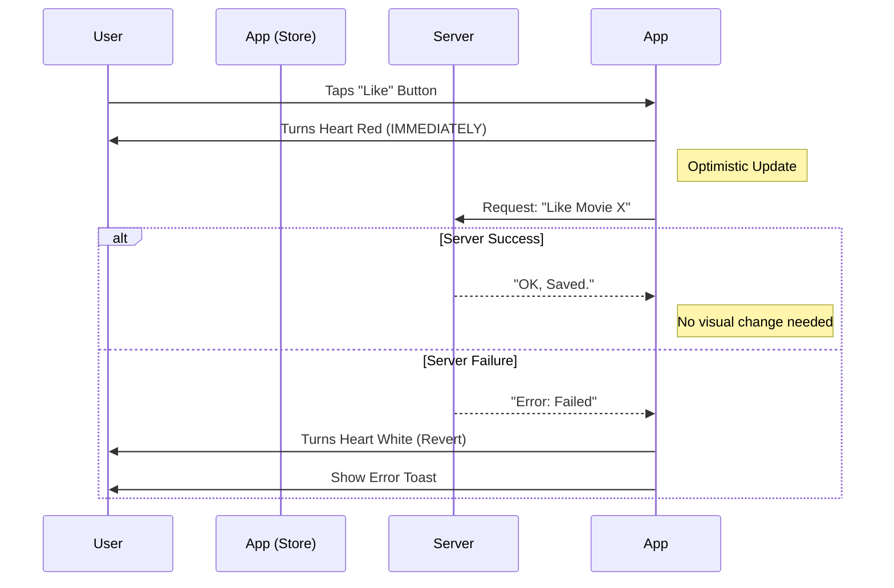

# User Lists Feature Documentation

## 1. Concept: How it Works
User Lists allow interaction and personalization. We support two types of lists:
1.  **Likes (♥)**: A quick way to say "I enjoyed this clip".
2.  **My List (+)**: A "Watch Later" feature to save movies you want to see.

**The "Optimistic" Approach:**
We use a technique called **Optimistic UI**.
*   **Normal UI**: You click Like -> App talks to Server -> Server says OK -> App turns Heart Red. (Slow!)
*   **Optimistic UI**: You click Like -> App turns Heart Red *immediately* -> App talks to Server in background. (Feels Instant!)

## 2. Configuration: Where is it set up?

### Database Relations
This is a "Many-to-Many" relationship.
*   **User**: Can like *many* movies.
*   **Movie**: Can be liked by *many* users.

We have specific tables/settings in `cineswipe-backend/prisma/schema.prisma` to link Users to Movies for both Likes and Watchlist.

## 3. Implementation: How did we build it?

### The Store (The Brain)
*   **File**: `cineswipe-mobile/src/lib/store.ts`
*   **State**: We keep two simple lists in the app's memory:
    *   `likedMovieIds`: A list of IDs like `["movie1", "movie5"]`.
    *   `watchlistMovieIds`: A list of IDs like `["movie2"]`.

### The Action (Toggling)
When you click the Heart button in `player/[id].tsx`:
1.  **Instant Update**: The store immediately adds/removes the ID from the list. The Heart turns red instantly.
2.  **API Call**: The app silently calls `POST /users/me/likes/:id` to tell the server.
3.  **Correction**: If the server fails (e.g., no internet), we revert the change (turn the Heart white again) and show an error.

### Syncing
When you log in, we call `fetchUserLists()`. This asks the server "Hey, what movies does this user like?" and updates the app's memory so your likes are there when you switch devices.

## 4. Visual Flow

