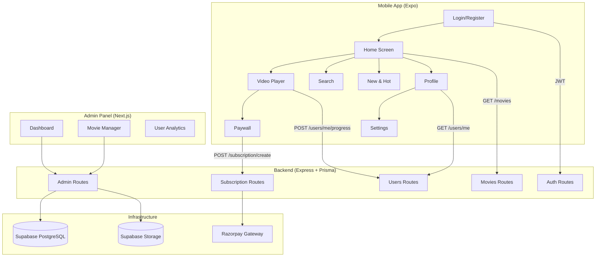

# CineSwipe — Production Readiness Audit & Launch Plan

## Executive Summary

CineSwipe is a Netflix-style short-form movie streaming app with three components: **React Native mobile app** (Expo), **Node.js/Express backend**, and **Next.js admin panel**. After a deep audit of every file, route, screen, and integration, here is the full status and the plan to go live.

---

## 1. Feature Audit — What Works Today

### ✅ Mobile App (Expo / React Native)

| Feature | Status | Notes |
|---|---|---|
| Login / Register | ✅ Working | JWT auth, validation, error handling |
| Home Screen | ✅ Working | Hero banner, trending, top 10, genre rows, pull-to-refresh |
| Continue Watching | ✅ Working | Auto-resumes from last clip index |
| Video Player | ✅ Working | Full-screen, swipe between clips, auto-advance, buffering indicator |
| Search | ✅ Working | Text search + genre filter + recent search history |
| New & Hot | ✅ Working | Coming Soon + Everyone's Watching sections |
| Profile | ✅ Working | Avatar, stats (Watching/Saved), saved movies grid, settings link |
| Like / Watchlist | ✅ Working | Optimistic toggle, persists to backend |
| Settings | ✅ Working | Sign out with confirmation modal |
| Paywall | ✅ Working | Razorpay integration, resume after payment |
| Deep Linking | ⚠️ Partial | `cineswipe://movie/:id` defined in Share but not configured in app.json |
| Push Notifications | ❌ Not Built | Bell icon exists on New & Hot but is a no-op |
| Offline Mode | ❌ Not Built | No local caching of movies beyond subscription cache |

### ✅ Backend (Express / Prisma / PostgreSQL)

| Feature | Status | Notes |
|---|---|---|
| Auth (Login/Register/Logout) | ✅ Working | bcrypt hashing, JWT 7-day expiry, rate limiting (5/min) |
| Movies CRUD | ✅ Working | Paginated list, single movie with clips & comments |
| User Lists (Like/Watchlist) | ✅ Working | Toggle endpoints, status check |
| Watch Progress | ✅ Working | Upsert progress, continue watching list (limit 10) |
| Comments | ✅ Working | Create comment on movie (authenticated) |
| Admin API | ✅ Working | Full CRUD for movies + clips, stats dashboard, file upload |
| Subscription System | ✅ Working | Razorpay create/verify/cancel/webhook, grace period logic |
| File Storage | ✅ Working | Supabase Storage with structured paths |
| Security Headers | ⚠️ Partial | `x-powered-by` disabled, but no helmet, no HSTS |
| Logging | ⚠️ Basic | `console.log` only — no structured logging |
| Error Handling | ⚠️ Basic | Try/catch in routes but no global error handler |

### ✅ Admin Panel (Next.js)

| Feature | Status | Notes |
|---|---|---|
| Admin Login | ✅ Working | httpOnly cookie auth |
| Dashboard (Stats) | ✅ Working | Movies/Clips/Users counts |
| Movie Management | ✅ Working | List, create, delete, manage clips |
| User Management | ✅ Working | View users, analytics page exists |
| File Upload | ✅ Working | Thumbnail, hero, trailer, clip uploads to Supabase |

---

## 2. Critical Blockers — Must Fix Before Launch

> [!CAUTION]
> These issues will cause **app rejection**, **security breaches**, or **user-facing failures** in production.

### 🔴 B1: Secrets Exposed in `.env` (Committed to Repo)

The `.env` file contains **live Supabase keys, JWT secret, and Razorpay credentials** in plaintext. This file is likely tracked by Git.

**Fix:** Add `.env` to `.gitignore`, rotate ALL secrets immediately, use environment variables on the hosting platform.

### 🔴 B2: Video Content is Placeholder

All 126 clips currently point to a single W3Schools demo video (`mov_bbb.mp4`). The app needs **real movie content** before launch.

**Fix:** Upload actual movie clips via the Admin Panel → Supabase Storage.

### 🔴 B3: Backend Not Deployed

The backend runs locally on `localhost:3001`. There is no production deployment.

**Fix:** Deploy to Railway/Render/Fly.io with production `.env` values.

### 🔴 B4: Razorpay Webhook Secret Not Set

`RAZORPAY_WEBHOOK_SECRET` is set to `"will_set_during_deployment"`. Webhook signature verification will fail in production.

**Fix:** Configure the webhook URL in Razorpay Dashboard, copy the secret to production env.

### 🔴 B5: Razorpay in Test Mode

Currently using `rzp_test_*` keys. Payments won't process real money.

**Fix:** Complete Razorpay KYC → switch to `rzp_live_*` keys for production.

### 🔴 B6: No App Splash Screen / App Icon

Default Expo placeholder icon and splash. App Store/Play Store will reject this.

**Fix:** Design and configure proper app icon (1024x1024) and splash screen in `app.json`.

### 🔴 B7: EAS Build Not Configured for Production

`eas.json` points to `https://cineswipe-backend-production.up.railway.app` which doesn't exist yet.

**Fix:** Deploy backend first → update the URL in `eas.json` → run `eas build`.

---

## 3. High-Priority Issues — Should Fix Before Launch

> [!WARNING]
> These won't cause immediate failure but will degrade user experience or cause problems at scale.

### 🟡 H1: No Security Headers (Helmet)

The backend doesn't use `helmet` for security headers (CSP, HSTS, X-Frame-Options, etc.).

### 🟡 H2: No Global Error Handler

Unhandled promise rejections or thrown errors will crash the server process.

### 🟡 H3: No Structured Logging

All logging is `console.log/error`. Need a proper logger (e.g., `pino` or `winston`) for production debugging.

### 🟡 H4: `new-popular.tsx` Has Hardcoded Countdown

The "Coming Soon" section shows `03d 12h 45m` as a static string, not a real countdown.

### 🟡 H5: Settings Items Are No-ops

"Notifications", "Privacy & Security", and "About" settings items don't navigate anywhere.

### 🟡 H6: No Privacy Policy / Terms of Service

Required by both app stores and by Razorpay for payment processing.

### 🟡 H7: No Email Verification

Users can register with any email without verification. Critical for account recovery.

### 🟡 H8: No Password Reset Flow

No "Forgot Password" functionality exists anywhere in the app.

### 🟡 H9: Thumbnail Images Use `picsum.photos`

All movie thumbnails are random Picsum images that change on every load. Need stable, real thumbnails.

### 🟡 H10: Admin Panel Not Deployed

The Next.js admin panel has no deployment configuration.

---

## 4. Nice-to-Have — Post-Launch Improvements

| Item | Priority | Effort |
|---|---|---|
| Push notifications (new content alerts) | Medium | 2-3 days |
| Offline mode / download clips | Medium | 3-5 days |
| Social login (Google/Apple) | Medium | 1-2 days |
| User profile picture upload | Low | 1 day |
| Content recommendation algorithm | Low | 3-5 days |
| In-app ratings & reviews | Low | 1-2 days |
| Multi-language support (i18n) | Low | 2-3 days |
| Analytics integration (Mixpanel/Amplitude) | Medium | 1-2 days |

---

## 5. Phased Execution Plan

### Phase 1: Security & Infrastructure (3-4 days)

- [ ] **Rotate all secrets** — Generate new JWT_SECRET, Supabase keys, Razorpay keys
- [ ] **Add `.env` to `.gitignore`** across all three projects
- [ ] **Install & configure Helmet** on the backend
- [ ] **Add global error handler middleware** to Express
- [ ] **Install Pino logger** — replace all `console.log` with structured logging
- [ ] **Deploy backend** to Railway (or Render/Fly.io)
  - Configure production env vars on the platform
  - Set `NODE_ENV=production`
  - Run `npx prisma migrate deploy`
- [ ] **Deploy admin panel** to Vercel
  - Configure `NEXT_PUBLIC_API_URL` to point to production backend
- [ ] **Configure Razorpay production webhook**
  - Set webhook URL: `https://your-backend.railway.app/subscription/webhook`
  - Copy webhook secret to production env

### Phase 2: Content & Branding (2-3 days)

- [ ] **Design app icon** (1024×1024 PNG, no transparency for iOS)
- [ ] **Design splash screen** (centered logo, brand colors)
- [ ] **Upload real movie content** via Admin Panel
  - For each movie: thumbnail, hero image, and 3-10 video clips
  - Minimum 10 movies with real content for launch
- [ ] **Replace Picsum thumbnails** with real, stable image URLs
- [ ] **Remove or fix "Coming Soon" hardcoded countdown**
- [ ] **Write Privacy Policy & Terms of Service** pages
  - Host on a simple webpage or within the app settings

### Phase 3: Polish & Missing Features (2-3 days)

- [ ] **Build "Forgot Password" flow**
  - Add endpoint `POST /auth/forgot-password` (send email with reset link)
  - Add endpoint `POST /auth/reset-password` (verify token, update password)
  - Add UI screen in mobile app
- [ ] **Add email verification** on registration (or defer to post-launch)
- [ ] **Wire up Settings screen items** (Notifications, Privacy, About)
  - Privacy → link to hosted privacy policy
  - About → app version, credits, contact email
  - Notifications → toggle push notification preferences (can be placeholder for now)
- [ ] **Fix deep linking** — configure `expo-linking` and `intentFilters` in `app.json`
- [ ] **Test paywall flow end-to-end** with Razorpay test mode before switching to live

### Phase 4: Build & Submit (2-3 days)

- [ ] **Create Apple Developer Account** ($99/year) if not already done
- [ ] **Create Google Play Developer Account** ($25 one-time) if not already done
- [ ] **Run EAS Build for Android**
  ```bash
  eas build --platform android --profile production
  ```
- [ ] **Run EAS Build for iOS**
  ```bash
  eas build --platform ios --profile production
  ```
- [ ] **Test production builds** on real devices
  - Test login, registration, video playback, like/watchlist, paywall, payment
- [ ] **Submit to Google Play Store**
  - Prepare store listing: screenshots, description, feature graphic
  - Content rating questionnaire
  - Privacy policy URL required
- [ ] **Submit to Apple App Store**
  - Prepare App Store Connect listing
  - Screenshots for all required device sizes
  - App Review notes (include test account credentials)
- [ ] **Switch Razorpay to live mode** after both stores approve

### Phase 5: Launch & Monitor (Ongoing)

- [ ] **Set up uptime monitoring** (UptimeRobot, Better Uptime)
- [ ] **Set up error tracking** (Sentry for mobile + backend)
- [ ] **Monitor Razorpay dashboard** for payment issues
- [ ] **Monitor Supabase usage** (storage, database connections)
- [ ] **Respond to user feedback** from app store reviews
- [ ] **Plan v1.1** with push notifications, social login, etc.

---

## 6. Cost Estimate (Monthly Production)

| Service | Free Tier | Estimated Cost |
|---|---|---|
| **Railway** (Backend hosting) | $5 free credit | ~$5-10/mo |
| **Supabase** (DB + Storage) | 500MB DB, 1GB Storage free | Free initially, ~$25/mo at scale |
| **Vercel** (Admin Panel) | Free for hobby | Free |
| **Razorpay** | No monthly fee | 2% per transaction |
| **Apple Developer** | — | $99/year |
| **Google Play** | — | $25 one-time |
| **Domain** (optional) | — | ~$12/year |
| **Total (startup)** | — | **~$10-35/month + store fees** |

---

## 7. Architecture Diagram



---

## Open Questions

> [!IMPORTANT]
> Please answer these before we start execution:

1. **Content Source**: Do you have actual movie clips ready to upload, or do we need to source/create sample content for launch?

2. **Domain**: Do you have a domain name for the backend API? (e.g., `api.cineswipe.com`) Or should we use the default Railway/Render subdomain?

3. **Hosting Preference**: Railway, Render, or Fly.io for the backend? All three have free tiers.

4. **App Store Accounts**: Do you already have Apple Developer ($99/yr) and Google Play ($25) accounts?

5. **Launch Scope**: Do you want to launch on **both** iOS and Android simultaneously, or start with Android only (faster, no Apple review)?

6. **Payment Go-Live**: Should we launch with the free tier only (no paywall) initially and add payments later, or launch with Razorpay live from day 1?

7. **Privacy Policy**: Do you have a privacy policy written, or should I generate one for you?
